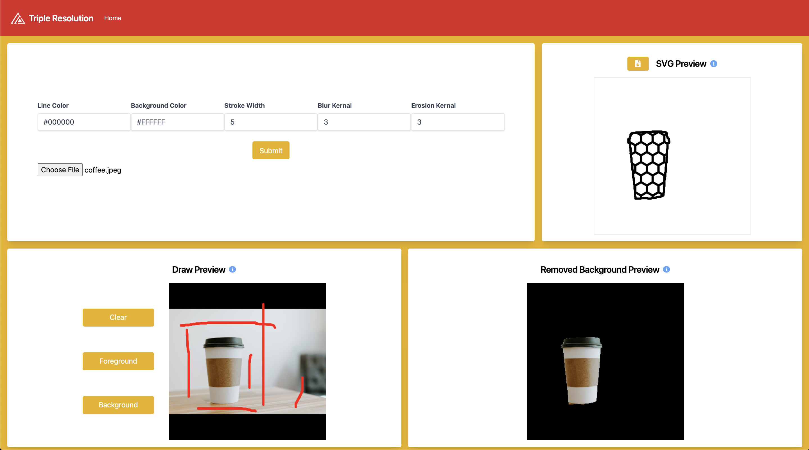

# Low Poly 

[](https://app.netlify.com/sites/low-poly/deploys)

[](https://opensource.org/licenses/MIT)

Low Poly is a React based website that takes advantage of WASM to generate digital art inspired by low poly art styles.



## Table of Contents
1. [Usage](##Usage)
2. [Demo](##Demo)
3. [Installation](##Installation)
4. [Support](##Support)

## Usage
1. Prepare the configurations for your image manipulation and submit them
2. Upload an image file
3. Aid the background removal using the foreground and background color strokes on the canvas
4. Allow the image to process
5. Bask in the glory of your brand new low poly inspired art
6. Download your awesome art in SVG format to be used wherever you want!

## Demo
You don't need to run this repo yourself to take advantage of Low Poly: [Try it here](https://lowpoly.tripleresolution.com/)
## Installation
- Download the required packages:
```
yarn install
```
This will install all dependencies needed to run the app.


- Run the development server:
```
yarn start
```
Runs the app in the development mode.\
Open [http://localhost:3000](http://localhost:3000) to view it in the browser.
## Support
You think the world needs more of my creations? Want to help motivate me more? Check out the my link below.

<a href="https://www.buymeacoffee.com/pIvCSjDLo" target="_blank"></a>

P.S. Your support doesn't have to be monetary, I also accept praise on any of my social media channels :)

P.P.S. If your favorite channel of support isn't listed, we can change that. Just bring it to my attention!
